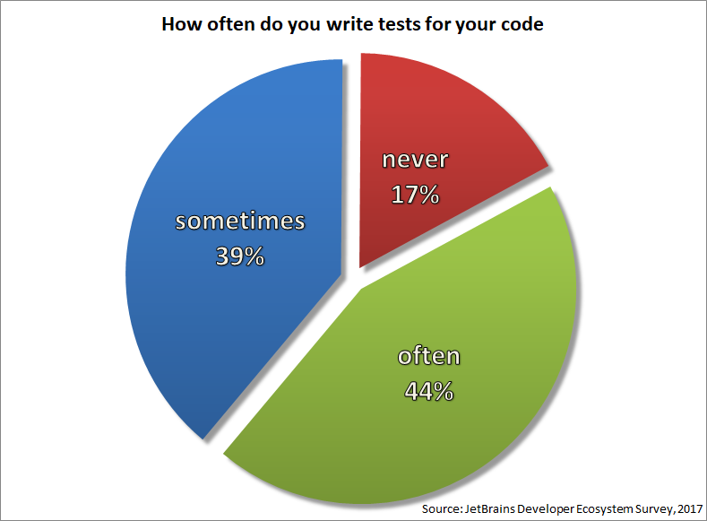
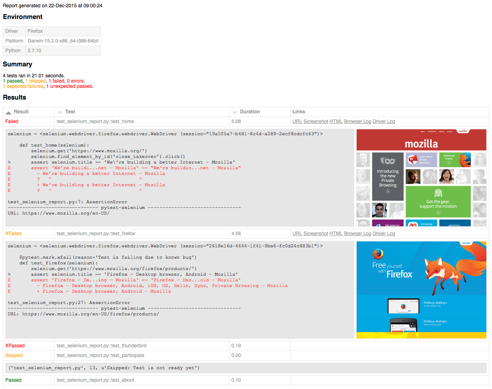
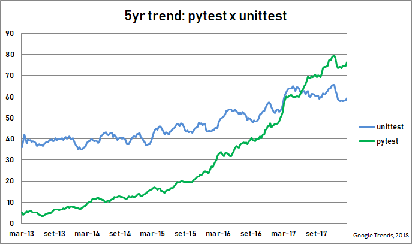

@title[Cover]

## Que Teste Foi Esse?! 
### pytest para desenvolvimento fullstack

<span style="font-size: 0.5em">[ Igor T. Ghisi, PythonSul, 2018-07-04 ]</span>

---
@title[Who Am I]

<div class="left">
<br>
<br>

</div>

<div class="right">
<p></p>
<p>@fa[github] igortg</p>
<p>@fa[twitter] figortg</p>
</div>

---

github.com/igortg/fullstack-python-tutorial

---
@title[JetBrains Survey]



---
@title[Not about testing]

This talk is not about testing


Note:
Not about the importance of testing
Cite ESSS Python 3 migration (XML tests)
---
@title[Contents]

Contents:

 - pytest intro
   - motivations
   - testing with pytest
   - fixtures
   - plug-ins
 - pytest on the backend
   - testing your DB
   - testing your API
 - pytest on the frontend
   - E2E tests with selenium

---

## motivations

---

<table cellspacing="0" cellpadding="6" border="1" align="center">
<tbody>
<tr>
<th colspan="2" width="20%">Java</th>
<th width="20%">Python</th>
</tr>

<tr>
<td colspan="2" width="20%" class="sidebyside">
<pre><code>
public class HelloWorld
{
  public static void main (String[] args)
  {
    <span class="skimlinks-unlinked">System.out.println("Hello, world!");
  }
}
</code></pre>
</td>

<td width="20%"  class="sidebyside">
<pre><code>


print("Hello, world!")


</code></pre>
</td>

</tr>
</tbody>
</table>

---

<table cellspacing="0" cellpadding="6" border="1" align="center">
<tr>
<th colspan="2" width="20%">unittest</th>
<th width="20%">pytest</th>
</tr>

<tr><td colspan="2" width="20%" class="sidebyside">
<pre><code class="sidebyside">
import unittest

class TestCase(unittest.TestCase):
  
  def test_hello_world():
    text = hello_world()
    self.assertEqual(text, "Hello World")
    
if &#95;&#95;name&#95;&#95; == '&#95;&#95;main&#95;&#95;':
    unittest.main() 
</code></pre>
</td><td width="20%" class="sidebyside">
<pre><code class="sidebyside">


def test_hello_world():
  assert hello_world() == "Hello World"


</code></pre>
</td></tr>
</table>

Note:
Pythonic
---

## testing with pytest

---
@title[roman7.py]

`roman7.py`

```python
def to_roman(n):
    '''convert integer to Roman numeral'''
    ...
    
def from_roman(s):
    '''convert Roman numeral to integer'''
    ...    
```

<span style="font-size: 0.5em;">Pilgrim, M. _Dive Into Python_</span>

---

@title[test_roman7.py]

`test_roman7.py`

```python
from roman7 import to_roman, from_roman

def test_roman_conversion():
    assert to_roman(3) == 'III'
    assert from_roman('IV') == 4
        
```

---
@title[tests structure]

Common folder structure

    .
    ├── tests\
    │   └── test_roman7.py
    ├── roman7.py
        
Installing 

    $ pip install pytest

or
    
    $ conda install pytest

---
@title[pytest runner.py]


---
@title[fixtures]

## fixtures

Note:
In the real word we must heavily trust on  
---
@title[roman7writer.py]

`roman7writer.py`

```python
def write_to_roman(text, output_filename):
    '''convert the given text numbers into roman and
     write it into a file'''
```

---?code=pytest-intro/tests/test_roman7writer.py
@title[Fixtures - naive test]

@[7-12](A naive test)

---
@title[Fixtures - naive test]


Note:
teste deixando rastro
---
@title[Fixtures - definition]

What is a fixture?

> provide a fixed baseline upon which tests can reliably and repeatedly 
execute. - pytest docs

---
@title[Fixtures - definition]

What is a fixture?

> solve real-world testing problems - Ghisi, 2018

---?code=pytest-intro/tests/test_roman7writer.py
@title[Fixtures - example]

@[15-20](fixture declaration)
@[17-18](setup)
@[19](fixture return value)
@[20](tear down)
@[23](fixture injection: tests receive fixture objects by naming them as an input arg)
@[23-27](fixtured test)

---
@title[Fixtures - example]


---
@title[shared fixtures]

### Sharing Fixtures

Just move the fixture function to a `conftest.py` file

    ├── roman\
    │   ├── tests\
    │   │   └── test_roman7.py
    │   └── roman7.py
    └── other\
    │   ├── tests\
    │   │      └── test_other.py
    │   └── other.py       
    ├── conftest.py
    └── main.py
    
---?code=pytest-intro/conftest.py

@title[shared fixtures]

@[7-11](fixture declared in conftest.py)

---?code=pytest-intro/tests/test_roman7writer.py
@title[shared fixtures]

@[29-34](fixture declared in conftest.py)

---

## plugins

---

Plugins: common quirks of testing solved by community shared fixtures


Note:
fixture é o recurso que o pytest disponibiliza para resolver os problemas do mundo real
---
@title[plugins install]

Installation

```
$ pip install pytest-X
```

*No activation or registration necessary*

---
@title[pytest-datadir]

### pytest-datadir

Access supporting data files from tests

```
├── test_csv_reader/
│   └── some.txt
└── test_roman7writer.py
```

```python
def test_read_module(datadir):
    contents = (datadir/'some.txt').read_text()
    write_to_roman(contents, str(datadir/'some.txt'))
    assert contents == 'eggs;cheese\n'
```

---
@title[pytest-mock]

### pytest-mock

`unittest.mock` helper for pytest

```
class UnixFS:
    @staticmethod
    def rm(filename):
        os.remove(filename)

def test_unix_fs(mocker):
    mocker.patch('os.remove')
    UnixFS.rm('file')
    os.remove.assert_called_once_with('file')
```

---
@title[pytest-localftpserver]

###  pytest-localftpserver

    def test_file_upload(ftpserver):
        ftp = FTP()
        ftp.connect("localhost", port=ftpserver.server_port)
        ftp.login("fakeusername", "qweqwe")
        ftp.cwd("/")
        ftp.mkd("FOO")
        ftp.quit()
    
    assert os.path.exists(os.path.join(ftpserver.server_home, "FOO"))

--- 
@title[pytest-qt]

### pytest-qt

Test Qt applications (supports PyQt and PySide)

```python
def test_hello(qtbot):
    widget = HelloWidget()
    qtbot.addWidget(widget)
    qtbot.mouseClick(window.button_greet, QtCore.Qt.LeftButton)
    assert window.greet_label.text() == 'Hello!'
```

--- 
@title[pytest-django]

### pytest-django

Fixtures to test your Django app

```
def test_with_client(client):
    response = client.get('/')
    assert response.content == 'Foobar'
```

---
@title[pytest-flask]

### pytest-flask

Fixtures to test your Flask app

```python
@api.route('/ping')
def ping():
    return jsonify(ping='pong')

def test_api_ping(client):
    res = client.get(url_for('api.ping'))
    assert res.json == {'ping': 'pong'}
```

---
@title[pytest-xdist]

### pytest-xdist

Run tests in parallel

```
$ pytest -n auto
======================= test session starts =======================
platform win32 -- Python 3.6.3, pytest-3.3.1, py-1.5.2, pluggy-0.6.0
plugins: xdist-1.20.1, forked-0.2, cov-2.5.1
gw0 [11] / gw1 [11] / gw2 [11] / gw3 [11]
scheduling tests via LoadScheduling
...........                                                  [100%]
==================== 11 passed in 0.60 seconds ====================
```

---
@title[pytest-cov]

### pytest-cov

Integration with `codecov`

```
pytest test_roman.py --cov roman7
======================= test session starts =======================
...
plugins: cov-2.5.1
collected 11 items

test_roman.py ...........

-------- coverage: platform win32, python 3.6.3-final-0 -----------
Name        Stmts   Miss  Cover
-------------------------------
roman7.py      29      0   100%

==================== 11 passed in 0.14 seconds ====================
```

---
@title[pytest-pep8]

### pytest-pep8

```
$ py.test --pep8
=========================== test session starts ============================
platform linux2 -- Python 2.7.6 -- py-1.4.30 -- pytest-2.7.2
rootdir: /tmp/doc-exec-2, inifile:
plugins: pep8, cache
collected 1 items

myfile.py F

================================= FAILURES =================================
________________________________ PEP8-check ________________________________
/tmp/doc-exec-2/myfile.py:2:10: E201 whitespace after '('
somefunc( 123,456)
         ^
/tmp/doc-exec-2/myfile.py:2:14: E231 missing whitespace after ','
somefunc( 123,456)
             ^

========================= 1 failed in 0.00 seconds =========================
```

---

@title[pytest-html]

### pytest-html

Beautiful HTML reports



---

Almost **400** plugins

plugincompat.herokuapp.com


---

## pytest vs unittests

---

| **pytest**                 |  **unittest** 
|----------------------------|-----------------------
| package                    | standard library @fa[check]
| `assert` @fa[check]        | `self.assert*`
| fixtures @fa[check]        | class inheritance
| plug-ins @fa[check]        | ??

---



Note:
Primeiro foram os evangelistas de testes em python, posteriormente a comunidade adotou pytest 

---

pytest can run unittest-based tests out of the box


---

## pytest on the backend


---

Back-end stack of our example:

- SQLite or Postgres
- SQLAlchemy
- Flask
- @fa[github]/ESSS/Flask-RESTAlchemy

---

Let's test our models first

---?code=toh-server/toh/model.py

@[7-18](Hero model)

---?code=toh-server/toh/tests/test_model.py

@[4-8](A simple test)
@[11-18](A test using DB fixture)

---

Testing the API

---?code=toh-server/toh/tests/test_api.py

@[7-9](Testing the GET method for heroes end-point)
@[11-15](Testing the GET method for heroes end-point)
@[17-20](And POST method)

---?code=toh-server/toh/conftest.py

@[8-13](The client fixture)

---
@title[pytest adoption]

TDD with SQLite, CI with Postgres
```python
def pytest_addoption(parser):
    parser.addoption('--postgres', action='store_true')


@pytest.fixture
def client(request):
    enable_postgres = request.config.getoption('postgres')
    init_app(app, enable_postgres)
    yield app.test_client()
    ... 
```

Running

    $ pytest --postgres

---?code=toh-server/toh/conftest.py

@[28-33](DB Session fixture)
@[16-25](DB Initialization fixture)

---

| Scope        | Fixture execution 
|--------------|-----------------------
| **function** | once per test
| **class**    | once per class of test
| **module**   | once per module
| **session**  | once per test session

---

## pytest on the frontend

---

pytest on JavaScript unit testing

<div class="fragment">

</div>

---

Initial test file for an Angular component

```javascript
import { async, ComponentFixture, TestBed } from '@angular/core/testing';
import { BannerComponent } from './banner.component';

describe('BannerComponent', () => {
  let component: BannerComponent;
  let fixture: ComponentFixture<BannerComponent>;

  beforeEach(async(() => {
    TestBed.configureTestingModule({
      declarations: [ BannerComponent ]
    })
    .compileComponents();
  }));

  beforeEach(() => {
    fixture = TestBed.createComponent(BannerComponent);
    component = fixture.componentInstance;
    fixture.detectChanges();
  });

  it('should create', () => {
    expect(component).toBeDefined();
  });
});
```

---

## pytest for end-to-end tests

---

_Python developer debugging tests on_  

<div class="left">
PyDev/PyCharm

</div>

<div class="left">
Chrome Dev Console

</div>

---

Required packages
- pytest | 
- selenium |
- chromderiver_binary (or geckodriver) |

---?code=e2e/conftest.py

@[3](Import selenium Chrome driver modules)
@[10-24](The driver fixture)
@[71-73](A helper fixture)
@[76-84](The driver fixture)

---

Live Demo


---?code=e2e/test_dashboard.py

@[9-16](Adding heroes)
@[17-20](Check if heroes were really added)

---?code=e2e/test_dashboard.py

@[27-32](Waiting for the search result to appear)

---
@title[People]

### It's About People

<div class="left">
<ul>
<li>Bruno Oliveira</li>
<li>@fa[twitter]@fa[github] nicoddemus</li>
<li>[pytest for unittest users](https://gitpitch.com/nicoddemus/pytest-for-unittest-users)</li>
</ul>
 
</div>

<div class="right">

</div>

---
@title[People]

### It's About People


</img>
<ul>
    <li>André Pastore</li>
    <li>@fa[github] apast</li>
    <li>Do nada, tudo se constrói. Testes & Web</li>
    <li>Dom. 13:30h</li>
</ul>

---


<pre class="attr-error">AttributeError: 'FireSystem' object has no attribute 'alamr'</pre> 

Note:
Para quem desenvolve com testes, ou com TDD.
Dar um improvement no seu framework de testes é como melhorar a sua IDE
O desenvolverdor acaba criando mais testes, fazendo testes de melhor qualidade,
e entregando um produto melhor, menos sucetível a falhas

---

### That's all


---


---